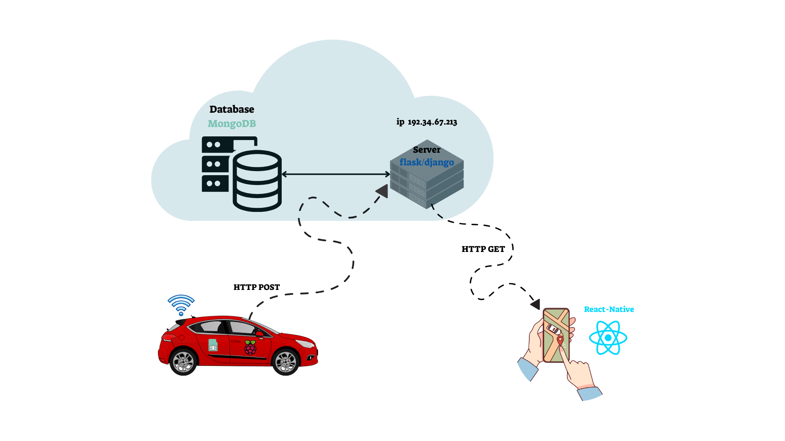

# AutoGuard

## Project Overview

A 4th-year engineering project to develop a comprehensive vehicle security system that combines GPS tracking, AI audio detection, and real-time alerts.  
This project uses a Raspberry Pi, a cloud-hosted server, and a database to store and manage data, along with a mobile app interface  
to enable car owners to monitor vehicle location in real time, identify drivers and receive alerts for unauthorized use.


## Project Diagram


## Installation
1. Clone the repository:
   ```bash
   git clone <repository-url>

