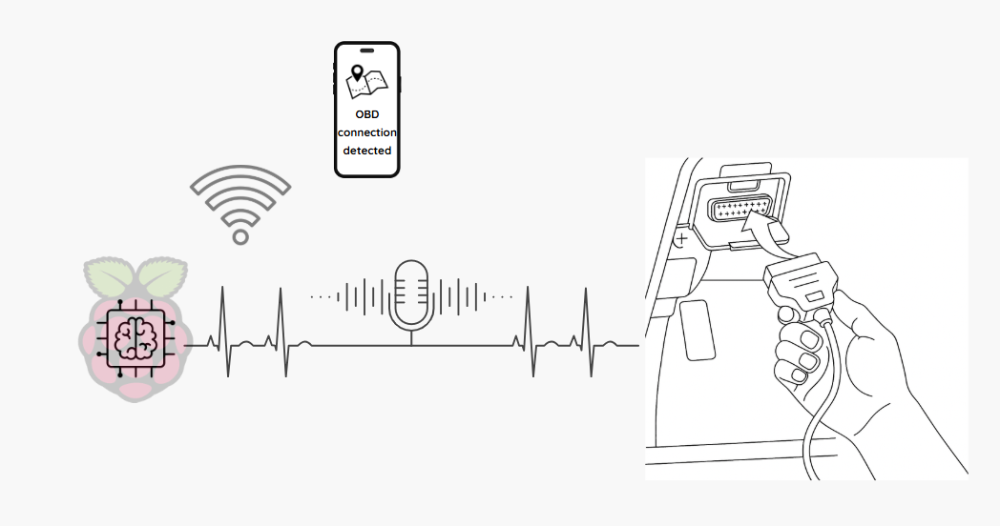
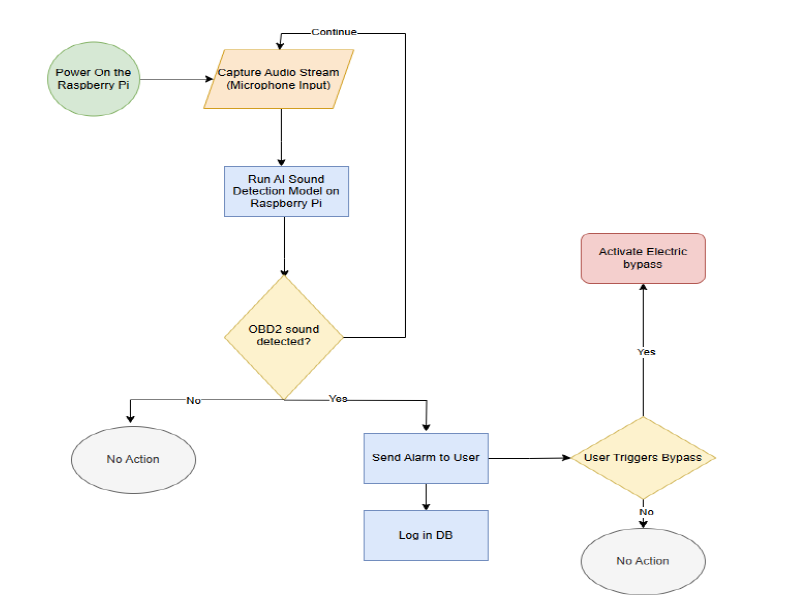

# AutoGuard – Real-Time Car Security via Audio-Based OBD Detection

## The Team

- **Israel Fahima**
- **David Bakshi**  
- **Group 109**  
- **Instructor**: [Matan Levy]

---

## Project Description

**AutoGuard** is a smart vehicle security system designed to detect unauthorized access to a car's OBD (On-Board Diagnostics) port — a common technique in modern car theft. 

The system uses **transfer learning** by extracting audio embeddings from a pre-trained YAMNet model and training custom classifiers to detect the characteristic click of an OBD connection. It integrates audio detection, GPS tracking via the SIM7600X module, and a React Native mobile app — all orchestrated by a Flask backend running on a Raspberry Pi.

### Project Diagram

---

## Getting Started

### Prerequisites

- Python 3.8+
- Raspberry Pi (for hardware integration)
- SIM7600X GSM/GPS module
- Android/iOS device with React Native development setup

### Python Dependencies

Install all required Python packages:

```bash
pip install -r requirements.txt
```

### requirements.txt

```txt
numpy==1.25.2
tensorflow==2.12.0
tensorflow-hub
flask
matplotlib
pandas
scikit-learn
pyAudioAnalysis
RPi.GPIO
```

---

## Installation

1. **Clone the repository**
   ```bash
   git clone https://github.com/DavidBakshi/AutoGuard.git
   cd AutoGuard
   ```

2. **Run the Flask backend**
   ```bash
   cd autoguard_backend
   python autoguard_server.py
   ```

3. **Launch the React Native mobile app**
   ```bash
   cd autoguard_app
   npx react-native run-android
   # or for iOS:
   npx react-native run-ios
   ```

---

## Project Structure

```plaintext
AutoGuard/
├── audio_model_training/         # Transfer learning with YAMNet and model evaluation
├── obd_vs_noise_classification/  # Traditional ML: KNN, SVM, Random Forest
├── autoguard_backend/            # Flask server (location + OBD detection)
├── autoguard_app/                # React Native mobile app
├── gsm_gps_sim7600X/             # GPS and HTTP logic with SIM7600X
├── assets/                       # diagrams.
└── README.md
```

---

## How It Works

1. Audio is recorded on the Raspberry Pi.
2. The trained model detects OBD plug-in sounds using YAMNet embeddings.
3. If detection occurs:
   - A POST is sent to the server (`/obd_detected`)
   - The GPS location from SIM7600X is sent via `/set_location`
4. The mobile app fetches `/current_location` and `/obd_detected`
5. A real-time alert banner is displayed in the app.

#### architecture diagram


---

## Evaluation & Results

To assess the effectiveness of our OBD sound detection pipeline, we conducted both offline model evaluation and real-world testing:

- **Audio Classification Pipeline**: We used transfer learning with YAMNet to extract 1024-dimensional embeddings from audio recordings representing OBD connection events and background noise.

- **Classifier Comparison**: In addition to the main model, we trained KNN, SVM, and Random Forest classifiers using handcrafted features extracted via `pyAudioAnalysis` — including MFCCs, energy, etc.

- **Neural Network Performance**: The final model — a shallow neural network trained on YAMNet embeddings — achieved **89.36% test accuracy**.

- **Threshold Analysis & ROC Curve**: We evaluated the model's sensitivity to different decision thresholds by generating a frame-level ROC curve and computing the Area Under Curve (AUC). This analysis helped determine the optimal threshold for detection.

- **Real-World Validation**: The system was deployed on a Raspberry Pi with a SIM7600X module. In live tests, OBD connection attempts triggered accurate alerts and GPS updates in the mobile app, confirming the system’s reliability under real-world conditions.

- **Accuracy & Robustness**: The deployed model maintained **high detection accuracy (89.36%)** with **low false positive rates** during actual driving and idling scenarios, making it suitable for practical car security applications.


---

## Technologies Used

- TensorFlow 2.12
- YAMNet (via `tensorflow-hub`)
- scikit-learn
- pyAudioAnalysis
- Flask
- React Native
- Raspberry Pi
- SIM7600X GSM/GPS module

---

## License

This project is part of the HUJI-SCE 67547 course and is intended for academic use as a 4th-year engineering project.
